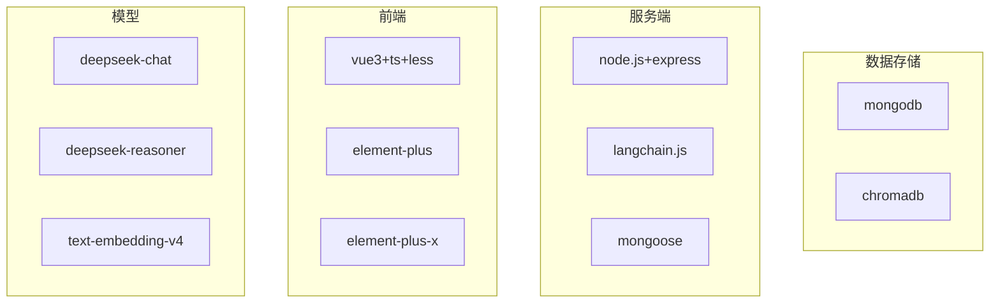
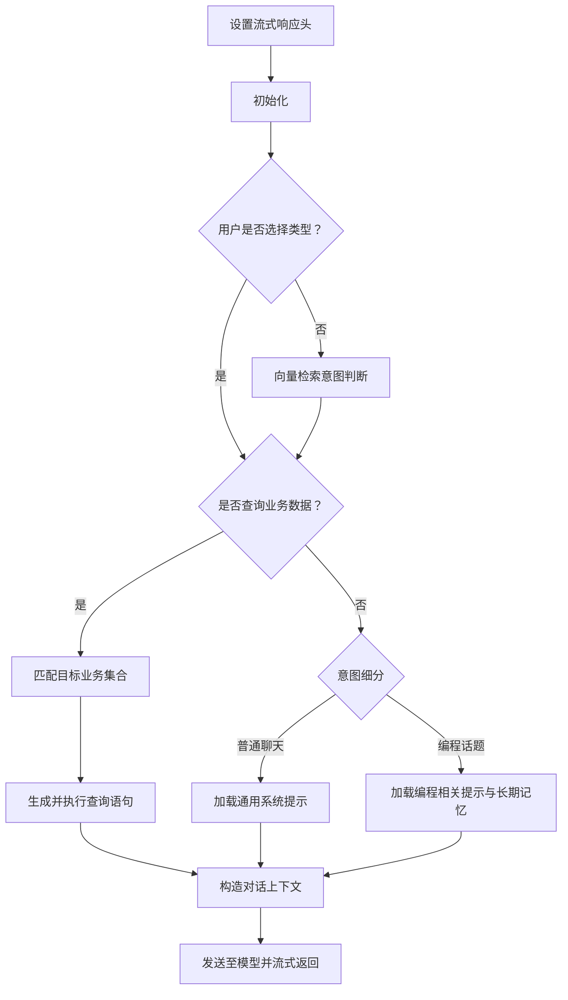

# 项目自述：AI 时代的学习与实践策略

> 在 AI 能力日益强大的今天，学习新技术的重心应从语法细节转向系统架构、技术选型与设计决策。核心问题不再是“代码怎么写”，而是“为什么这么做”。  
> 例如：即便你从未写过 Python，只需明确目标，即可让 AI 生成初始代码，再由人工审查与调整；遇到问题，也可随时交由 AI 辅助诊断。  
> 本文记录了一个渐进式的搭建过程——从最小可行对话系统起步，逐步集成 LangChain 的各项能力，在实践中体悟用户意图分类、RAG、向量检索、短期/长期记忆等概念的真实含义。文中穿插的个人提问示例，亦可供参考。

---

## 初始化

- server、web均需安装依赖
- mongodb创建数据库system_db、bus_db
- 执行`npm run init`，判断有无.env文件，若没有.env则生成；初始化mongodb数据库，可用此命令重置数据库，不会重置.env文件

## 启动

- **启动chroma服务**：`npm run chroma`
- **启动node服务**：`npm run node`
- **启动前端**：`npm run web`

## 技术栈总览



## 一、模型

deepseek-chat用来快速意图分析，实际对话用deepseek-reasoner，text-embedding-v4是文本向量化的
随便挑个模型直接付费就行，我半个月只用了不到3毛钱。
需要注意的是要支持文本向量化，我就是上来付费了ds，后来发现不支持向量化，又付费了百炼

## 二、数据存储

#### 1. mongodb

##### 用途

- 业务数据存储
- 业务集合元数据（记录集合用途、字段描述等，用于向量检索匹配）
- 会话（Session）持久化
- 用户信息、对话历史、长期记忆存储

##### 建议

- 强烈推荐安装 MongoDB Compass，安装 MongoDB 时勾选相应选项即可。
- 测试数据可通过 AI 生成 JSON 后直接导入。示例提问：

```text
我需要 2 份 JSON 数据导入 MongoDB 用于测试，集合名、字段等不限，每份约 20 条记录，数据准确性不做严格要求。
```

#### 2. chromadb

##### 用途

存储向量数据，支持语义相似度检索：

- **问题模板向量**：区分用户意图（查询业务数据 / 普通聊天 / 编程相关）。
- **业务集合向量**：匹配用户查询所对应的具体 MongoDB 集合。

##### 安装与启动

- 下载地址：[Chroma Releases](https://github.com/chroma-core/chroma/releases)
- 无需安装，解压后参照[官方文档](https://docs.trychroma.com/docs/overview/getting-started#typescript)直接运行即可。

示例提问（用于生成问题模板数据）：

```text
我需要一份json导入mongodb作为问题模板集合，用于向量检索用户提问是业务数据查询还是普通聊天
```

## 三、服务端

#### (1) node.js+express

之前没了解过可以使用ai生成代码，提示词示例

##### 快速起步提示词示例

即使没有 Node.js 经验，也可借助 AI 生成基础框架：

```text
你是一位资深 Node.js 开发工程师，请使用 Node.js + Express 生成后端项目，要求：
- 允许跨域访问
- 实现用户登录
- 会话持久化存储到 MongoDB
- 使用 Mongoose 连接 MongoDB
- 针对订单集合实现增删改查接口
```

##### 注意事项

- 用户登录与会话持久化非必需，后续可按需补充。
- **跨域必须由后端处理**，请勿使用前端 devServer 代理，否则流式传输可能出现异常。
- 生成代码后，可参照其中的接口模式开发 AI 对话相关接口。例如：

```text
AI 对话功能需要：会话列表、聊天记录表（存储会话 ID）、新增对话时先创建会话，再依次创建 role="user" 与 role="ai" 两条记录，其中 AI 回复需流式返回。请设计新增对话的接口方案。并生成Node.js + Express可以直接使用的代码。
```

#### (2) langchain.js

LangChain 最大的价值在于**提供能力全景参考**。当你用模型 API 跑通基础对话后，可以翻阅 LangChain 文档，了解它提供了哪些模块（如 Chains、Agents、Memory、Retrievers 等），并尝试手动实现一个简化版本。重点是理解功能背后的设计动机，而非盲目调用封装。

#### (3) mongoose

**重要提醒**
Mongoose 默认会将模型名转换为**复数形式**作为集合名（并非简单加 s），因此建议在定义 Schema 时**显式指定集合名称**。

**示例：根据 Compass 导出的 JSON Schema 生成 Mongoose Schema**

```
以下json是从mongodb compass中导出的role集合的schema,
据此生成mongoose的schema，要求显示声明集合名
{
  "$jsonSchema": {
    "bsonType": "object",
    "required": ["_id", "code", "role", "style"],
    "properties": {
      "_id": {
        "bsonType": "objectId"
      },
      "code": {
        "bsonType": "string"
      },
      "role": {
        "bsonType": "string"
      },
      "style": {
        "bsonType": "string"
      }
    }
  }
}
```

## 四、前端

- vue3
- **TypeScript**（个人反思：若非必要，引入 TS 可能增加初期负担，导致大量类型报错干扰进度）
- **element-plus**
- **Element Plus X**(强烈推荐)：历史列表、输入框、展示md、对话气泡列表等功能很完善，节省很多时间专注于ai开发
- **Fetch API**：用户流式响应的请求，直接用的ai生成的代码

**快速生成登录页示例**

```text
使用vue3 ts less element-plus生成登陆页面，仅生成登陆页面文件即可
```

## 名词解释

- **集合**（Collection）：MongoDB 中一组文档的容器，类似关系型数据库的表。
- **Schema**：定义数据库结构，包括字段、类型、索引等约束。
- **会话**（History）：系统右侧的对话列表项，对应 history 集合中的一条记录。每次发起新对话时，该会话下的历史记录将作为短期记忆传入模型。
- **对话**（Chat）：单轮问答记录，包含用户问题与 AI 回复，存储在 chat 集合中，每条记录关联所属会话 ID。
- **命名说明**：会话与对话的命名参考了 Element-Plus-X 组件命名习惯，代码中可能存在混用现象。

## 聊天接口逻辑



1. **设置响应头**：配置为流式输出。
2. **初始化**：若无 `historyId` 则新建会话，并计算当前对话序号。
3. **类型预判**：前端支持用户选择“默认 / 聊天 / 查询业务数据”。
4. **意图向量检索**（用户未选择时）：维护问题模板集合并向量化，每次调用时增量更新未标记向量，与用户问题进行相似度匹配。
5. **业务数据查询**：

- 将业务集合的元数据向量化，匹配用户问题对应的集合；
- 结合匹配结果与用户问题，由模型生成查询语句并执行；
- 将查询结果与原始问题组合为对话上下文。

6. **聊天意图细分**：当前通过轻量模型判断“普通聊天”或“编程话题”，以加载不同的系统提示（Role & Style）与长期记忆。未来若话题增多，可考虑与步骤 4 的意图识别合并。

## 结语

整个项目采用**渐进式搭建**的思路：先用最简方案跑通核心流程，再根据实际痛点逐步引入 LangChain 等工具的能力。这种“边用边优化”的过程，能让你更深刻地理解每一项技术决策背后的权衡与收益。
文中提及的各类 AI 辅助提问示例，均来自个人真实开发记录，希望能为你的实践提供些许启发。
