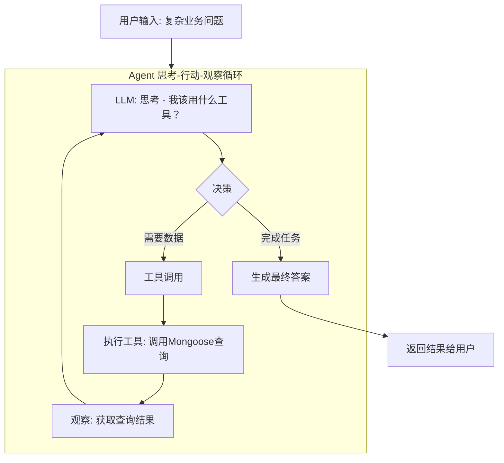

要将现有工作流升级为Agent，核心是在Node.js中构建一个“**思考-行动-观察**”的循环。这里提供一份逻辑设计与可直接运行的代码，帮助理解并开始动手。

### 🧭 Agent 处理流程（逻辑图）

下图展示了Agent如何处理一个复杂的业务问题：



此流程是一个闭环，模型会自主判断何时调用工具、分析结果，并决定是继续调用工具还是结束任务并回答用户。

### 💻 可运行的核心代码

#### 1. 准备工作

首先，在项目中安装必要的依赖：
`bash
npm install ai @ai-sdk/openai zod
`

#### 2. 定义工具 (`tools.js`)

将你的业务逻辑封装成模型可调用的工具。这里需要用到Mongoose的聚合（aggregate）查询。

```javascript
const mongoose = require('mongoose');
const { tool } = require('ai');
const { z } = require('zod');
// 定义 Mongoose 模型，请根据你的业务调整 Schema
const salesSchema = new mongoose.Schema({
  productId: String,
  productName: String,
  amount: Number,
  region: String,
  saleDate: Date,
});
const Sales = mongoose.model('Sales', salesSchema);
// 工具1: 查询某区域、某月内销售额最高的 N 个产品
const queryTopProducts = tool({
  description: '查询指定区域和月份内，销售额最高的前N个产品。用于获取某个区域的销售排行。',
  parameters: z.object({
    region: z.string().describe('要查询的区域，例如 \"华东区\"'),
    year: z.number().describe('年份，例如 2025'),
    month: z.number().describe('月份，例如 5'),
    limit: z.number().default(3).describe('返回的产品数量，默认为3')
  }),
  execute: async ({ region, year, month, limit }) => {
    console.log(`📊 [Tool] 查询${year}年${month}月 ${region} 销售额TOP${limit}产品`);
const startDate = new Date(year, month - 1, 1);
const endDate = new Date(year, month, 0);

    const results = await Sales.aggregate([
      { $match: { region: region, saleDate: { $gte: startDate, $lte: endDate } } },
      { $group: { _id: \"$productId\", name: { $first: \"$productName\" }, totalAmount: { $sum: \"$amount\" } } },
      { $sort: { totalAmount: -1 } },
      { $limit: limit }
    ]);

    return results.length > 0 ? JSON.stringify(results) : `在${year}年${month}月的${region}未找到销售数据。`;

}
});
// 工具2: 获取特定产品在指定时间段的销售额
const getProductSales = tool({
description: '获取特定产品在指定时间段（某个月）的总销售额。用于对比产品在不同月份的销售情况。',
parameters: z.object({
productId: z.string().describe('产品的唯一标识符'),
year: z.number().describe('年份，例如 2025'),
month: z.number().describe('月份，例如 6')
}),
execute: async ({ productId, year, month }) => {
console.log(`📊 [Tool] 查询产品${productId}在${year}年${month}月的销售额`);
const startDate = new Date(year, month - 1, 1);
const endDate = new Date(year, month, 0);

    const results = await Sales.aggregate([
      { $match: { productId: productId, saleDate: { $gte: startDate, $lte: endDate } } },
      { $group: { _id: \"$productId\", name: { $first: \"$productName\" }, totalAmount: { $sum: \"$amount\" } } }
    ]);

    return results.length > 0 ? JSON.stringify(results[0]) : `产品${productId}在${year}年${month}月无销售记录。`;

}
});
module.exports = { queryTopProducts, getProductSales };
```

#### 3. 配置Agent核心 (`agent.js`)

此模块是Agent的大脑，负责初始化模型和工具，并运行核心循环。

```javascript
const { openai } = require("@ai-sdk/openai");
const { generateText } = require("ai");
const { queryTopProducts, getProductSales } = require("./tools");
// 初始化 LLM 模型，请确保设置了 OPENAI_API_KEY 环境变量
const model = openai("gpt-4o");
// 用于存放对话历史
let conversationHistory = [];
async function runAgent(userQuestion) {
  console.log(`🙋 用户提问: ${userQuestion}`);
  // 1. 初始化消息历史，设置系统提示词
  conversationHistory = [
    {
      role: "system",
      content: `你是一个数据分析助手，负责回答业务问题。

      你可以使用以下工具：
      - queryTopProducts: 查询指定区域、指定月份内销售额最高的产品。
      - getProductSales: 查询特定产品在指定月份的销售额。

      请严格遵循ReAct模式：思考(Thought) -> 行动(Action) -> 观察(Observation) -> 重复，直到能给出最终答案。
      最终答案必须基于工具返回的数据。
      如果遇到错误或数据不足，请如实告知用户。`,
    },
    { role: "user", content: userQuestion },
  ];
  const MAX_STEPS = 10;
  let step = 0;
  let finalAnswer = null;
  // 2. 运行 Agent 循环
  while (step < MAX_STEPS && !finalAnswer) {
    step++;
    console.log(`\
🔄 Agent 步骤 ${step}: 正在思考...`);
    try {
      // 3. 调用 LLM，告知其可用的工具
      const result = await generateText({
        model: model,
        messages: conversationHistory,
        tools: {
          queryTopProducts: queryTopProducts,
          getProductSales: getProductSales,
        },
        maxSteps: 5, // 允许模型单次响应中调用多个工具
      });
      // 4. 处理 LLM 的响应
      if (result.toolCalls && result.toolCalls.length > 0) {
        // 4.1. 如果有工具调用，将调用信息加入历史
        conversationHistory.push({
          role: "assistant",
          content: result.toolCalls
            .map((tc) => `调用工具 ${tc.toolName}(${JSON.stringify(tc.args)})`)
            .join(
              "\
",
            ),
        });
        // 4.2. 执行工具调用，并将结果作为 \"tool\" 角色消息加入历史
        for (const toolCall of result.toolCalls) {
          console.log(
            `🔧 执行工具: ${toolCall.toolName} 参数: ${JSON.stringify(toolCall.args)}`,
          );
          const toolResult = await toolCall.execute();
          console.log(`✅ 工具结果: ${toolResult.substring(0, 200)}...`);

          conversationHistory.push({
            role: "tool",
            content: toolResult,
            toolCallId: toolCall.toolCallId,
            toolName: toolCall.toolName,
          });
        }
      } else {
        // 4.3. 如果没有工具调用，说明LLM已得出最终答案，结束循环
        finalAnswer = result.text;
        console.log(`💡 最终答案: ${finalAnswer}`);
        break;
      }
    } catch (error) {
      console.error("Agent运行出错:", error);
      finalAnswer = "抱歉，处理您的问题时遇到了内部错误，请稍后重试。";
      break;
    }
  }
  if (step >= MAX_STEPS) {
    finalAnswer =
      "抱歉，处理您的问题时步骤过多，可能过于复杂，请尝试换一种问法。";
  }
  // 清空历史，准备下一次查询
  conversationHistory = [];
  return finalAnswer;
}
module.exports = { runAgent };
```

#### 4. 集成Express路由 (`app.js`)

将Agent功能集成到你的Express应用中，提供一个简单的API接口。

```javascript
const express = require("express");
const { runAgent } = require("./agent");
const app = express();
app.use(express.json());
// 用于接收用户提问的 API 端点
app.post("/api/chat", async (req, res) => {
  const { question } = req.body;

  if (!question) {
    return res.status(400).json({ error: "问题不能为空" });
  }
  try {
    // 调用Agent处理问题
    const answer = await runAgent(question);
    res.json({ answer });
  } catch (error) {
    console.error("API处理出错:", error);
    res.status(500).json({ error: "处理请求时发生错误" });
  }
});
const PORT = process.env.PORT || 3000;
app.listen(PORT, () => {
  console.log(`🚀 Agent 服务已启动，监听端口 ${PORT}`);
});
```

### ⚙️ 工作原理与关键点

1. **封装业务为“工具”**：将复杂的数据库查询逻辑（如`queryTopProducts`）包装成LLM能理解的函数，并提供清晰描述和参数定义。这就是所谓的`Tool-use`或`Function Calling`[reference:0]。
2. **实现“思考-行动-观察”循环**：
   _ **思考**：LLM分析用户问题和当前上下文，决定下一步行动。
   _ **行动**：LLM发出调用某个工具的指令（如`queryTopProducts`）。
   _ **观察**：系统执行工具，将返回的数据（Observation）再喂给LLM。
   _ 这个循环重复进行，直到LLM认为信息足够并给出最终答案[reference:1]。
3. **处理多轮工具调用**：上述代码逻辑可处理“先查询Top产品，再针对每个产品查询本月销售额进行对比”的复杂任务[reference:2]。

### 🔧 扩展与生产环境建议

这个核心框架可以平稳地向更健壮的生产级应用演进。

- **转向Agent框架**：生产环境中，建议使用**Vercel AI SDK**[reference:3]或**Mastra**[reference:4]等成熟框架，它们提供了更完善的消息管理、错误处理和可观测性。

* **引入MCP协议**：采用**Model Context Protocol (MCP)** 将工具进行标准化封装[reference:5]。你的Express应用可以成为一个MCP Server，使工具可被任何MCP客户端（如Cursor、Claude Desktop）发现和调用[reference:6]。
* **强化稳定与安全**：
  \_ **错误处理**：为`execute`函数增加`try...catch`，确保返回描述性错误信息给LLM。
* **查询安全**：如果工具涉及SQL生成，务必使用参数化查询或做好严格的输入校验，防止注入攻击。
* **历史管理**：当前`conversationHistory`简单存在内存。生产环境应使用Redis或数据库持久化会话。
  \_ **监控与调试**：记录每一步的输入输出和LLM响应，便于后续分析和优化。\* **混合架构路由**：在API入口（`/api/chat`）增加一层判断。对于高置信度的简单查询（如“查询华东区订单”），可直接走原有高效工作流；只有复杂、模糊的请求才路由到Agent，以平衡成本与性能。
  这份代码提供了一个清晰的起点。动手尝试并逐步优化，你就能在现有架构上，构建出能够自主解决复杂业务问题的智能体。
