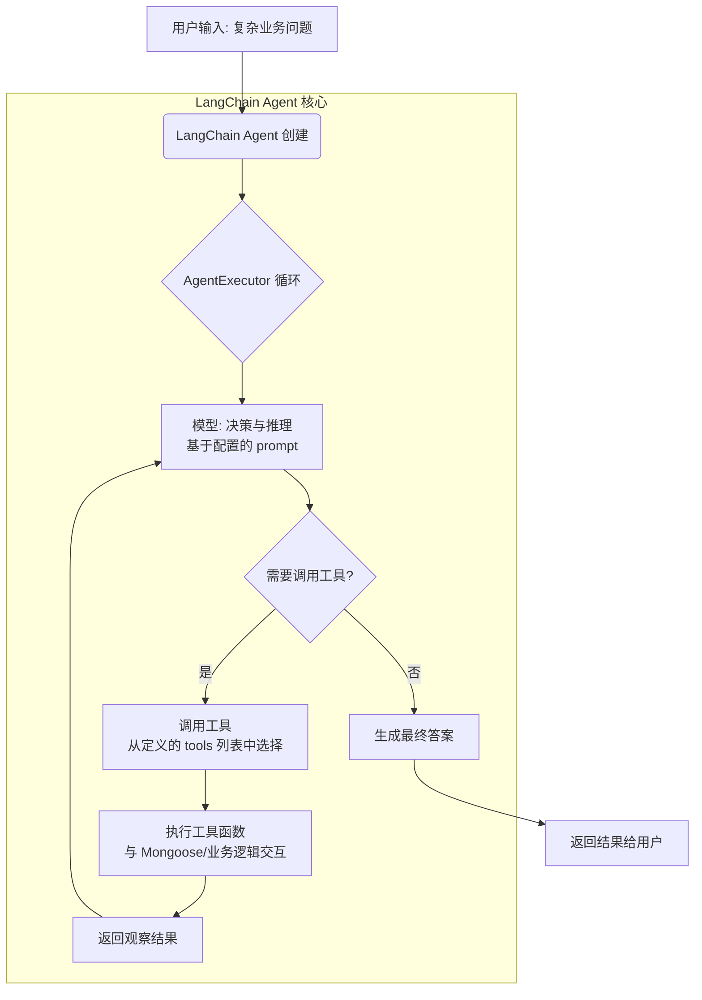

根据你的要求，已将Agent实现从Vercel AI SDK迁移到`LangChain.js`。为了获得最佳的生产就绪特性，以下代码基于`LangChain v1.0+`的`createAgent` API构建[reference:0]。

这是处理你提出的业务问题的Agent逻辑图，展示了`LangChain`是如何实现之前讨论的“思考-行动-观察”循环的：



### 💻 迁移后的全量代码

以下是基于 `LangChain.js` 重构后的核心代码。为了方便对比，我使用了与之前相同的业务场景和 Mongoose 模型结构。

#### 1. 项目初始化与依赖安装

首先，在项目根目录下安装所需的 `LangChain` 相关包和 `zod`（用于定义工具参数的模式）。

```bash
npm install langchain @langchain/openai @langchain/core zod
```

#### 2. 定义工具 (`tools.js`)

`LangChain` 使用 `tool` 函数来定义工具，这与之前 Vercel AI SDK 的概念非常相似，但用法略有不同。你需要提供一个 `schema` 和 `func` 或 `execute` 函数[reference:1]。

```javascript
const mongoose = require("mongoose");
const { tool } = require("langchain");
const { z } = require("zod");

// 定义 Mongoose 模型，请根据你的业务调整 Schema
const salesSchema = new mongoose.Schema({
  productId: String,
  productName: String,
  amount: Number,
  region: String,
  saleDate: Date,
});

const Sales = mongoose.model("Sales", salesSchema);

// 工具1: 查询某区域、某月内销售额最高的 N 个产品
const queryTopProducts = tool(
  async ({ region, year, month, limit }) => {
    console.log(
      `📊 [Tool] 查询${year}年${month}月 ${region} 销售额TOP${limit}产品`,
    );
    const startDate = new Date(year, month - 1, 1);
    const endDate = new Date(year, month, 0);

    const results = await Sales.aggregate([
      {
        $match: {
          region: region,
          saleDate: { $gte: startDate, $lte: endDate },
        },
      },
      {
        $group: {
          _id: "$productId",
          name: { $first: "$productName" },
          totalAmount: { $sum: "$amount" },
        },
      },
      { $sort: { totalAmount: -1 } },
      { $limit: limit },
    ]);

    return results.length > 0
      ? JSON.stringify(results)
      : `在${year}年${month}月的${region}未找到销售数据。`;
  },
  {
    name: "query_top_products",
    description:
      "查询指定区域和月份内，销售额最高的前N个产品。用于获取某个区域的销售排行。",
    schema: z.object({
      region: z.string().describe("要查询的区域，例如 '华东区'"),
      year: z.number().describe("年份，例如 2025"),
      month: z.number().describe("月份，例如 5"),
      limit: z.number().default(3).describe("返回的产品数量，默认为3"),
    }),
  },
);

// 工具2: 获取特定产品在指定时间段的销售额
const getProductSales = tool(
  async ({ productId, year, month }) => {
    console.log(`📊 [Tool] 查询产品${productId}在${year}年${month}月的销售额`);
    const startDate = new Date(year, month - 1, 1);
    const endDate = new Date(year, month, 0);

    const results = await Sales.aggregate([
      {
        $match: {
          productId: productId,
          saleDate: { $gte: startDate, $lte: endDate },
        },
      },
      {
        $group: {
          _id: "$productId",
          name: { $first: "$productName" },
          totalAmount: { $sum: "$amount" },
        },
      },
    ]);

    return results.length > 0
      ? JSON.stringify(results[0])
      : `产品${productId}在${year}年${month}月无销售记录。`;
  },
  {
    name: "get_product_sales",
    description:
      "获取特定产品在指定时间段（某个月）的总销售额。用于对比产品在不同月份的销售情况。",
    schema: z.object({
      productId: z.string().describe("产品的唯一标识符"),
      year: z.number().describe("年份，例如 2025"),
      month: z.number().describe("月份，例如 6"),
    }),
  },
);

module.exports = { queryTopProducts, getProductSales };
```

#### 3. 配置Agent核心 (`agent.js`)

这里我们使用 `LangChain v1.0` 引入的 `createAgent` 函数，它极大地简化了 Agent 的创建过程[reference:2][reference:3]。

```javascript
const { createAgent } = require("langchain");
const { ChatOpenAI } = require("@langchain/openai");
const { queryTopProducts, getProductSales } = require("./tools");

// 初始化 LLM 模型，请确保设置了 OPENAI_API_KEY 环境变量
const model = new ChatOpenAI({
  model: "gpt-4o",
  temperature: 0,
});

// 使用 createAgent 创建 agent 实例
const agent = createAgent({
  model: model,
  tools: [queryTopProducts, getProductSales],
  systemPrompt: `你是一个数据分析助手，负责回答业务问题。
      你可以使用以下工具：
      - query_top_products: 查询指定区域、指定月份内销售额最高的产品。
      - get_product_sales: 查询特定产品在指定月份的销售额。

      请严格遵循ReAct模式：思考(Thought) -> 行动(Action) -> 观察(Observation) -> 重复，直到能给出最终答案。
      最终答案必须基于工具返回的数据。
      如果遇到错误或数据不足，请如实告知用户。`,
});

async function runAgent(userQuestion) {
  console.log(`🙋 用户提问: ${userQuestion}`);

  try {
    // 调用 agent，传入用户问题
    const result = await agent.invoke({
      messages: [{ role: "user", content: userQuestion }],
    });

    // 从结果中提取最后一条消息作为最终答案
    const finalMessage = result.messages[result.messages.length - 1];
    const finalAnswer = finalMessage.content;

    console.log(`💡 最终答案: ${finalAnswer}`);
    return finalAnswer;
  } catch (error) {
    console.error("Agent运行出错:", error);
    return "抱歉，处理您的问题时遇到了内部错误，请稍后重试。";
  }
}

module.exports = { runAgent };
```

#### 4. 集成Express路由 (`app.js`)

这部分与之前保持一致，只是现在它调用的是 `LangChain` 驱动的 `runAgent` 函数。

```javascript
const express = require("express");
const { runAgent } = require("./agent");

const app = express();
app.use(express.json());

// 用于接收用户提问的 API 端点
app.post("/api/chat", async (req, res) => {
  const { question } = req.body;

  if (!question) {
    return res.status(400).json({ error: "问题不能为空" });
  }

  try {
    // 调用LangChain Agent处理问题
    const answer = await runAgent(question);
    res.json({ answer });
  } catch (error) {
    console.error("API处理出错:", error);
    res.status(500).json({ error: "处理请求时发生错误" });
  }
});

const PORT = process.env.PORT || 3000;
app.listen(PORT, () => {
  console.log(`🚀 LangChain Agent 服务已启动，监听端口 ${PORT}`);
});
```

### 💡 关键差异与使用提示

1.  **API核心差异**：
    - **`LangChain`**: 使用 `createAgent` 和 `tool` 函数，遵循其特定的API格式[reference:4]。
    - **`Vercel AI SDK`**: 使用 `generateText` 并传入 `tools` 对象。
    - **结果处理**：`LangChain` 的 `agent.invoke` 返回的是一个包含完整对话历史的 `messages` 数组，你需要从中提取最后一条消息作为最终答案。

2.  **工具命名规范**：
    `LangChain` 建议使用 `snake_case` 命名工具（如 `query_top_products`），这有助于提升在不同模型提供商间的兼容性[reference:5]。

3.  **Agent配置**：
    `createAgent` 接受一个 `systemPrompt` 选项，你可以用它来为Agent设置全局的系统指令，而无需手动构建复杂的提示模板[reference:6]。

### 🔧 生产环境扩展

- **错误处理与重试**: 在 `tools.js` 的 `execute` 函数内部增加更健壮的 `try-catch` 逻辑，确保向LLM返回描述性错误信息。
- **上下文与记忆**: 可通过 `createAgent` 的 `contextSchema` 和 `store` 选项为Agent添加用户上下文和长期记忆，实现个性化交互[reference:7]。
- **流式响应**: `createAgent` 支持流式响应，可以通过 `.stream()` 方法获取实时的推理和工具调用过程，提升用户体验[reference:8]。
- **MCP集成**: 如果需要更复杂的工具编排，可以研究 `LangChain` 对 `Model Context Protocol (MCP)` 的支持，将工具标准化并解耦[reference:9][reference:10]。
- **监控与调试**: 记录每次Agent运行的输入、中间步骤（工具调用）和最终输出，这对于分析和优化Agent行为至关重要。
